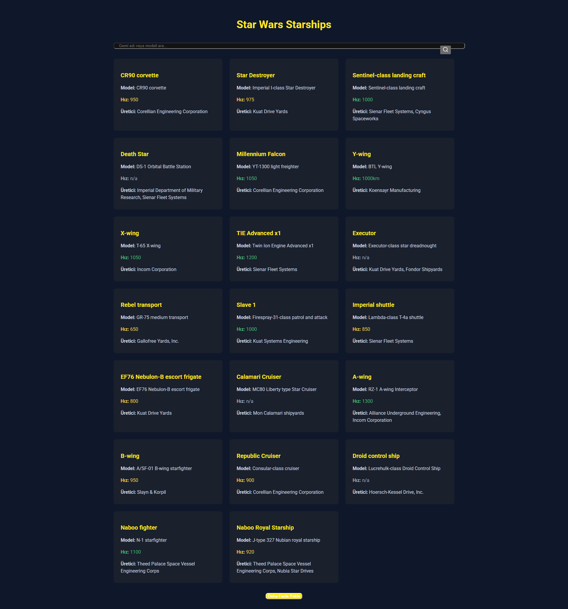
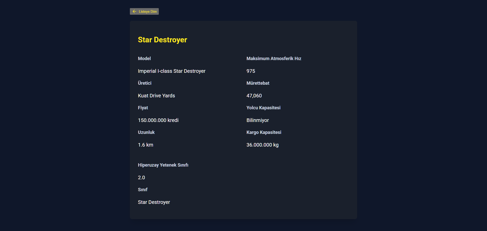

# Star Wars Starships App



## Proje Hakkında / About the Project

### Türkçe

Bu proje, Star Wars evrenindeki yıldız gemilerini listeleyen, aramanıza ve detaylarını görüntülemenize olanak sağlayan bir web uygulamasıdır. Tüm veriler [SWAPI (Star Wars API)](https://swapi.dev/) kullanılarak elde edilmiştir.

### English

This project is a web application that lists, allows searching, and displays detailed information about starships from the Star Wars universe. All data is obtained using the [SWAPI (Star Wars API)](https://swapi.dev/).

## Özellikler / Features

### Türkçe

- Yıldız gemilerinin liste halinde görüntülenmesi
- Adına veya modeline göre yıldız gemileri arasında arama yapabilme
- Her bir yıldız gemisinin detaylı bilgilerini görüntüleme
- "Daha Fazla" butonu ile ek yıldız gemilerini yükleyebilme
- Gemi hızına göre renkli gösterim (Hızlı gemiler yeşil, orta hız sarı, düşük hız kırmızı)

### English

- List view of Star Wars starships
- Search functionality to find starships by name or model
- Detailed information view for each starship
- "Load More" button to load additional starships
- Color-coded speed display (Fast ships in green, medium speed in yellow, low speed in red)

## Kullanılan Teknolojiler / Technologies Used

- React
- Vite
- Tailwind CSS
- Lucide React (icons)
- SWAPI (Star Wars API)

## Kurulum / Installation

### Türkçe

1. Projeyi klonlayın:
```bash
git clone [https://github.com/ahmetemreari/starwars-app]
```

2. Proje dizinine gidin:
```bash
cd star-wars-app
```

3. Gerekli paketleri yükleyin:
```bash
npm install
```

4. Uygulamayı başlatın:
```bash
npm run dev
```

5. Tarayıcınızda `http://localhost:5173` adresine gidin.

### English

1. Clone the project:
```bash
git clone [https://github.com/ahmetemreari/starwars-app]
```

2. Navigate to the project directory:
```bash
cd star-wars-app
```

3. Install the required packages:
```bash
npm install
```

4. Start the application:
```bash
npm run dev
```

5. Go to `http://localhost:5173` in your browser.

## Kullanım / Usage

### Türkçe

- Ana sayfada tüm yıldız gemileri listelenmiştir
- Arama kutusuna gemi adı veya modeli yazarak arama yapabilirsiniz
- Herhangi bir gemi kartına tıklayarak detaylı bilgilere ulaşabilirsiniz
- Detay sayfasından "Listeye Dön" butonu ile ana sayfaya dönebilirsiniz
- Listenin sonunda "Daha Fazla Yükle" butonuna tıklayarak daha fazla gemi yükleyebilirsiniz

### English

- All starships are listed on the main page
- You can search by entering the ship name or model in the search box
- You can access detailed information by clicking on any ship card
- You can return to the main page from the detail page using the "Back to List" button
- You can load more ships by clicking the "Load More" button at the end of the list

## Ekran Görüntüleri / Screenshots




## Bağımlılıklar / Dependencies

```json
{
  "dependencies": {
    "lucide-react": "^0.288.0",
    "react": "^18.2.0",
    "react-dom": "^18.2.0"
  },
  "devDependencies": {
    "@types/react": "^18.2.15",
    "@types/react-dom": "^18.2.7",
    "@vitejs/plugin-react": "^4.0.3",
    "autoprefixer": "^10.4.16",
    "postcss": "^8.4.31",
    "tailwindcss": "^3.3.3",
    "vite": "^4.4.5"
  }
}
```
